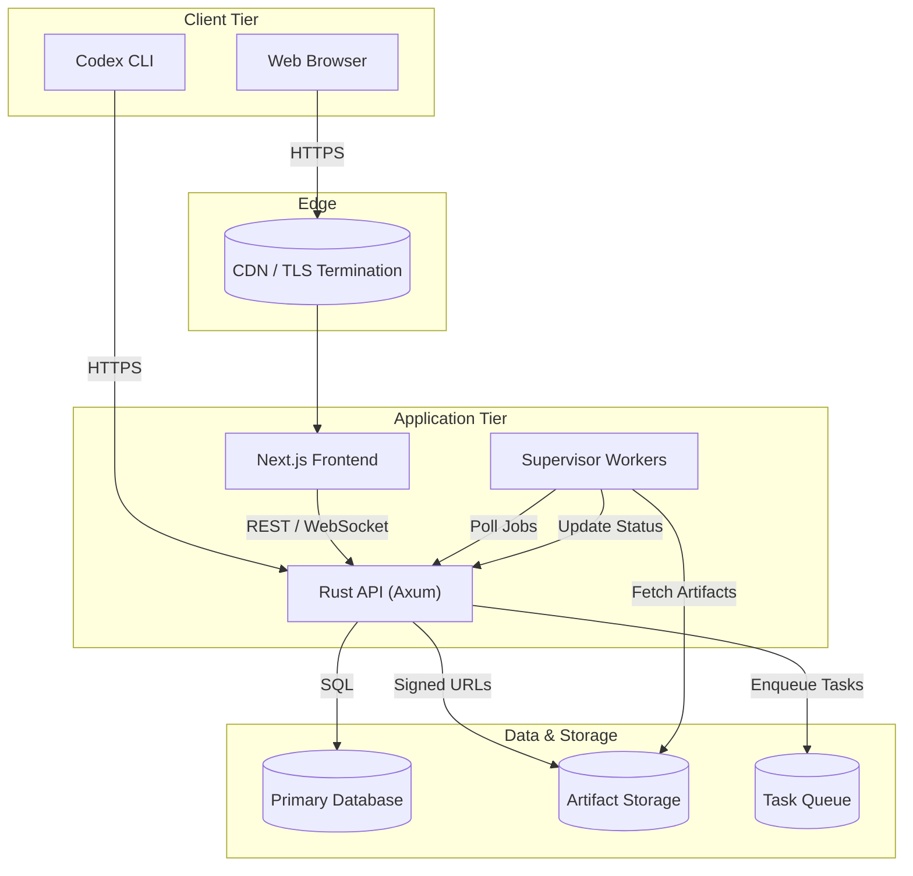

# Codex Cloud Architecture Diagram

## Component Responsibilities

- **Next.js Frontend** – Serves the operator dashboard, authenticates via the API, and streams task updates to users.
- **Rust API** – Implements authentication, repository onboarding, task execution workflows, and artifact publishing.
- **Supervisor Workers** – Execute queued tasks against managed environments while reporting status and artifacts back to the API.
- **Primary Database** – Stores identities, repositories, environments, task metadata, and audit trails.
- **Artifact Storage** – Houses generated artifacts and execution logs for download.
- **Task Queue** – Buffers execution requests for asynchronous supervisor processing.

## Deployment Notes

- Containers are orchestrated via Docker Compose for local development, with a path to ECS/Kubernetes by mirroring the service boundaries above.
- Secrets are injected with environment variables and should be sourced from a managed secrets store in production.
- Each component exposes structured health checks for observability and workload autoscaling.
